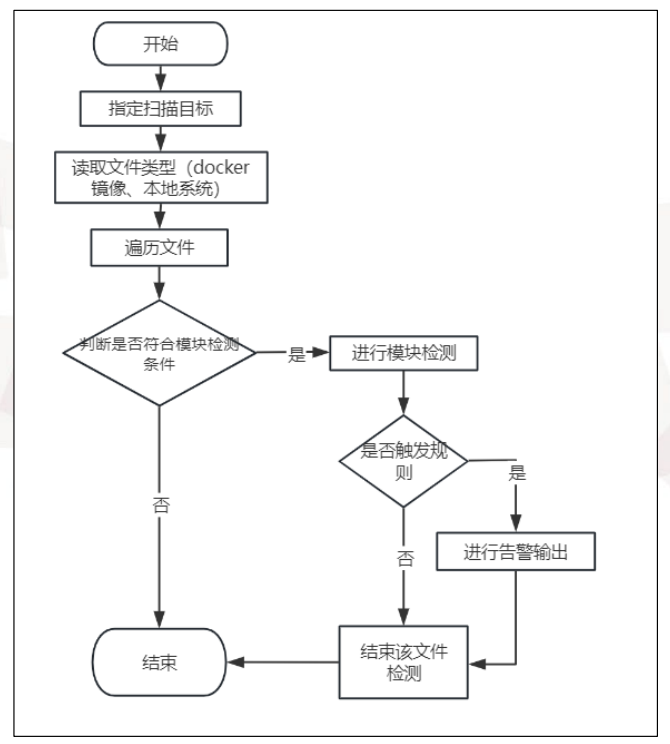

# XCOSX

XC + OS（操作系统）+X（X卫士）。面向操作系统的容器、镜像、文件系统扫描工具。支持扫描敏感信息、软件包漏洞、webshell、弱口令等问题。

# 使用

无需安装，release有已经编译好的win和linux环境下的可执行文件，直接运行即可

# 功能介绍
## 1. 漏洞扫描（软件层面）

通过[脚本](https://github.com/gtqbhksl/xcosx_db)爬取xcosx_db漏洞库，在扫描过程中 读取系统中软件包的版本信息，与漏洞库中的信息进行对比。

## 2. webshell检测

webshell检测采用正则+神经网络识别结合的方式，神经网络模型训练、超参数调优见[这里](https://github.com/gtqbhksl/xcosx_webshell_detect)

## 3. 弱口令检测

可以通过文本解析的方法获取用户名和密码信息。 将获取到的用户名和密码，与规则库中的弱口令进行比对，或者采用对规则库中的弱口令进行加密， 与存储的加密密码对比，判断是否存在弱口令信息， 对匹配到的弱口令信息进行记录

## 4. 敏感信息检测

通过正则匹配敏感信息， 56种不同的敏感信息类别，如 AWS 密钥、GitHub 访问令牌、信用卡号等，制定了一套详细的正则表达式规则，共计 82 条规则。

# 架构

# 流程图

# TODO

未来的工作将致力于将漏洞数据库的构建和更新过程融入系统的核心功能，使得系统在启动时能够自动拉取最新的漏洞数据库，确保安全扫描的时效性和准确性。

其次，弱口令检测功能目前仅支持有限的几种服务组件。

再者，Webshell检测神经网络模型的训练和参数调优，寻找最优的网络结构和超参数设置，以提高对新型和变种Webshell的检测能力。

# 论文&答辩ppt

毕业论文与答辩PPT见：[https://github.com/gtqbhksl/xcosx_paper](https://github.com/gtqbhksl/xcosx_paper)